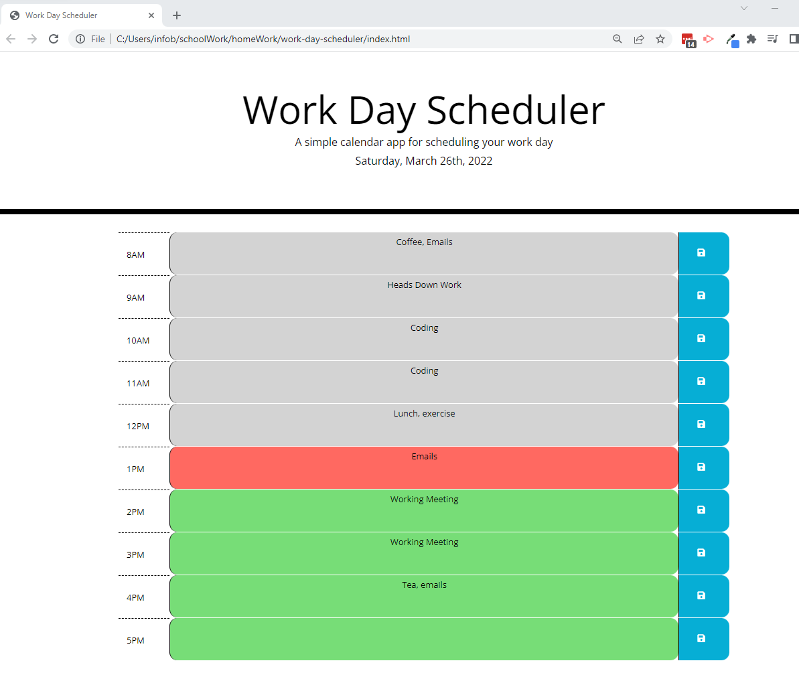

# work-day-scheduler

## User Story

```md
AS AN employee with a busy schedule
I WANT to add important events to a daily planner
SO THAT I can manage my time effectively
```

## Acceptance Criteria

```md
GIVEN I am using a daily planner to create a schedule
WHEN I open the planner
THEN the current day is displayed at the top of the calendar
WHEN I scroll down
THEN I am presented with timeblocks for standard business hours
WHEN I view the timeblocks for that day
THEN each timeblock is color coded to indicate whether it is in the past, present, or future
WHEN I click into a timeblock
THEN I can enter an event
WHEN I click the save button for that timeblock
THEN the text for that event is saved in local storage
WHEN I refresh the page
THEN the saved events persist
```

## Link to Application:
https://bkhandag.github.io/work-day-scheduler/

## Pseudo Code:
1. Initialize p # current day with current time using moment.js
1. Initialize function for the page that populates this Time
1. Build out time blocks in html given the existing styling
1. write an event handler for current time.
1. Write an event listener that initiates comparision of time blocks with current time
1. Write Function to compare timeblocks:
1. If timeblock == past time, color it grey.
1. if timeblock == current time, color it red
1. if timeblock == future time, color it green.
1. May be include this in the init as well
1. Write a func to set local storage by allowing user to add description
1. Identify html tag to use to allow user entry
1. Save string to local storage upon click of button.
1. Write a function to get item to to keep value populated on screen.

## Screenshot


